# Лабораторная работа №3.
**Цель лабораторной работы:**
Исследовать влияние параметра “темп обучения” на
процесс обучения нейронной сети на примере решения задачи классификации Food-101 с
использованием техники обучения Transfer Learning.

**Задачи:**
1. С использованием [1] и техники обучения Transfer Learning обучить нейронную сеть
EfficientNet-B0 (предварительно обученную на базе изображений imagenet) для
решения задачи классификации изображений Food-101 с использованием
фиксированных темпов обучения 0.01, 0.001, 0.0001.
2.  Реализовать и применить в обучении следующие политики изменения темпа
обучения, а также определить оптимальные параметры для каждой политики:
* Косинусное затухание (Cosine Decay) [2,4]
* Косинусное затухание с перезапусками (Cosine Decay with Restarts) [3,4]

**Замечание**: В данной лабораторной работе бьл параметр BATCH_SIZE равен 32.

## 1. С использованием [1] и техники обучения Transfer Learning обучить нейронную сеть EfficientNet-B0 (предварительно обученную на базе изображений imagenet) для решения задачи классификации изображений Food-101 с использованием фиксированных темпов обучения 0.01, 0.001, 0.0001.
* **Графики обучения EfficientNetB0 с использованием фиксированных темпов обучения 0.01, 0.001, 0.0001**:  
   * График точности epoch_categorical_accuracy:
   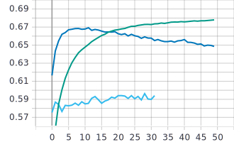
   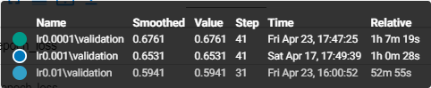
 
   * График функции потерь epoch_loss:
   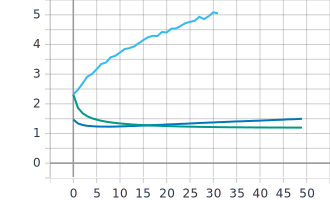
   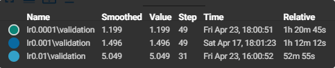
 * **Анализ полученных результатов**: Наивысшие значения метрики точности наблюдаются на графике с темпом обучения 0.0001 (67.8%). Также на графике функции потерь у нейронной сети с темпом 0.0001 наблюдаются наименьшие значения (1.199). Можно сказать, что в данной ситуации шаг 0.0001 является оптимальным для политики с фиксированным темпом обучения.

## 2. Реализовать и применить в обучении следующие политики изменения темпа обучения, а также определить оптимальные параметры для каждой политики: Косинусное затухание (Cosine Decay) [2,4], Косинусное затухание с перезапусками (Cosine Decay with Restarts) [3,4]
* **Графики обучения EfficientNetB0 с использованием политики изменения темпа обучения Cosine Decay**:  
   * График точности epoch_categorical_accuracy:
   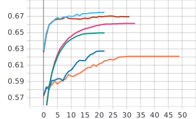
   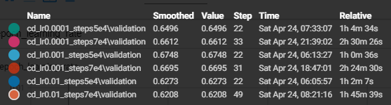
 
   * График функции потерь epoch_loss:
   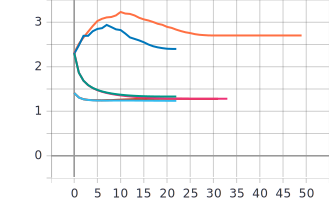
   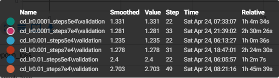
   
   * Графики темпов обучения epoch_learning_rate:
   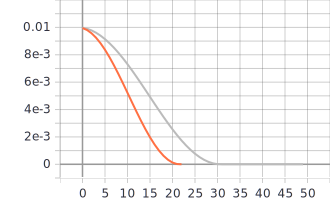
   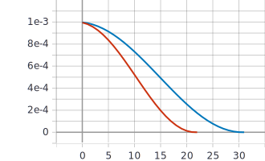
   
   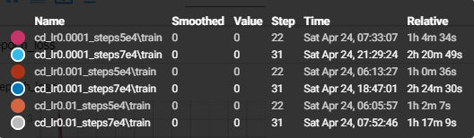
 * **Анализ полученных результатов**: Некоторые обучения прерывались в силу того, что количестов "степов" превысило количество "степов" затухания decay_steps и learning_rate принимал значение 0. Наивысшие значения метрики точности с политикой косинусного затухания наблюдаются на графике с параметрами initial_learning_rate = 0.001 и decay_steps = 50000 (67.48%). При этих же параметрах наблюдаются наименьшие значения функции потерь (1.235). Можно сказать, что из выбранных тестовых параметров, оптимальными для политики cosine decay являются выше перечисленные.
   
* **Графики обучения EfficientNetB0 с использованием политики изменения темпа обучения Cosine Decay with Restarts**:  
   * График точности epoch_categorical_accuracy:
   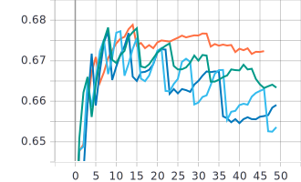
   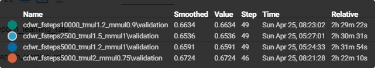
 
   * График функции потерь epoch_loss:
   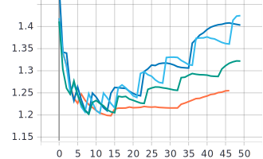
   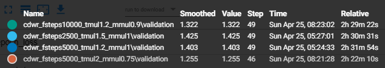
   
   * Графики темпов обучения epoch_learning_rate:
   
   
   
   
