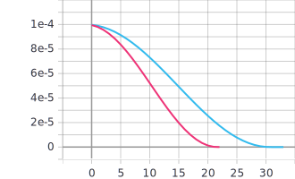
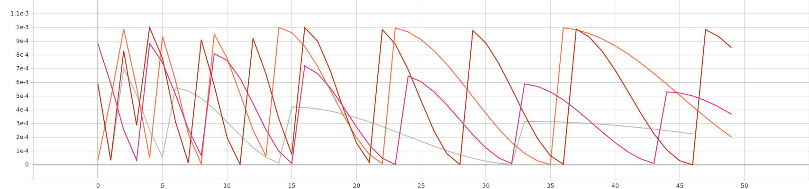
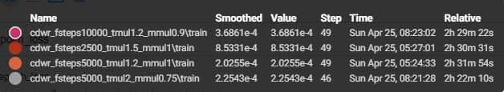

# Лабораторная работа №3.
**Цель лабораторной работы:**
Исследовать влияние параметра “темп обучения” на
процесс обучения нейронной сети на примере решения задачи классификации Food-101 с
использованием техники обучения Transfer Learning.

**Задачи:**
1. С использованием [1] и техники обучения Transfer Learning обучить нейронную сеть
EfficientNet-B0 (предварительно обученную на базе изображений imagenet) для
решения задачи классификации изображений Food-101 с использованием
фиксированных темпов обучения 0.01, 0.001, 0.0001.
2.  Реализовать и применить в обучении следующие политики изменения темпа
обучения, а также определить оптимальные параметры для каждой политики:
* Косинусное затухание (Cosine Decay) [2,4]
* Косинусное затухание с перезапусками (Cosine Decay with Restarts) [3,4]

**Замечание**: В данной лабораторной работе параметр BATCH_SIZE равен 32.

## 1. С использованием [1] и техники обучения Transfer Learning обучить нейронную сеть EfficientNet-B0 (предварительно обученную на базе изображений imagenet) для решения задачи классификации изображений Food-101 с использованием фиксированных темпов обучения 0.01, 0.001, 0.0001.
* **Графики обучения EfficientNetB0 с использованием фиксированных темпов обучения 0.01, 0.001, 0.0001**:  
   * График точности epoch_categorical_accuracy:
   
   
 
   * График функции потерь epoch_loss:
   
   
 * **Анализ полученных результатов**: Наивысшие значения метрики точности наблюдаются на графике с темпом обучения 0.0001 (67.8%). Также на графике функции потерь у нейронной сети с темпом 0.0001 наблюдаются наименьшие значения (1.199). Можно сказать, что в данной ситуации шаг 0.0001 является оптимальным для политики с фиксированным темпом обучения.

## 2. Реализовать и применить в обучении следующие политики изменения темпа обучения, а также определить оптимальные параметры для каждой политики: Косинусное затухание (Cosine Decay) [2,4], Косинусное затухание с перезапусками (Cosine Decay with Restarts) [3,4]  
Параметры политики cosine decay, которые изменялись в ходе выполнения:  
initial_learning_rate - начальный темп обучения.  
decay_steps - количество "степов" до затухания темпа обучения.  
* **Графики обучения EfficientNetB0 с использованием политики изменения темпа обучения Cosine Decay**:
   * График точности epoch_categorical_accuracy:
   
   
 
   * График функции потерь epoch_loss:
   
   
   
   * Графики темпов обучения epoch_learning_rate:
   
   
   
   
 * **Анализ полученных результатов**: Некоторые обучения прерывались в силу того, что количестов "степов" превысило количество "степов" затухания decay_steps и learning_rate принимал значение 0. Наивысшие значения метрики точности с политикой косинусного затухания наблюдаются на графике с параметрами initial_learning_rate = 0.001 и decay_steps = 50000 (67.48%). При этих же параметрах наблюдаются наименьшие значения функции потерь (1.235). Можно сказать, что из выбранных тестовых параметров, оптимальными для политики cosine decay являются выше перечисленные.
   
* **Графики обучения EfficientNetB0 с использованием политики изменения темпа обучения Cosine Decay with Restarts**:  
  Параметры политики cosine decay with restarts, которые изменялись в ходе выполнения:  
  first_decay_steps - начальное количество шагов до затухания, после чего происходит рестарт.  
  t_mul - множитель количества шагов после очередного рестарта.  
  m_mul - множитель learning_rate после очередного рестарта.  
  Стоит отметить, что в данном пункте значение параметра initial_learning_rate не изменялось и равно 0.001.  
  
   * График точности epoch_categorical_accuracy:
   
   
 
   * График функции потерь epoch_loss:
   
   
   
   * Графики темпов обучения epoch_learning_rate:
   
   
 * **Анализ полученных результатов**: Наивысшие значения метрики точности с политикой cosine decay with restarts достигаются на 14 эпохе с параметрами политики first_decay_steps = 5000, t_mul = 2.0, m_mul = 0.75 (67.89%). На той же эпохе достигается минимальное значение функции потерь (1.198). Стоит отметить, что это наилучшие значения среди всех проведенных обучений. Из приведенных тестовых параметров, вышеперечисленные являются наиболее оптимальными.
## Вывод
Мы выделили оптимальные параматеры для каждой политики изменения темпа обучения. Хоть и разница в точности между нейронными сетями из каждой политики почти одинаковые, можно заметить, что с политикой cosine decay with restarts нейронная сеть довольна быстрее сошлась к своему пиковому состоянию (на 14 эпохе). Однако, думаю, можно добиться более хороших результатов, если еще проверить другие значения параметров.
